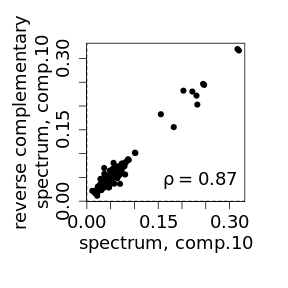

# Inference of germline mutational processes

The vignette describes inference of spatially-varying mutational processes. The guideline starts with matrix of regional mutation rates of mutation types in genomic regions, infers mutational components, estimates their biological relevance and groups in strand-independend/strand-dependent mutational processes. Finally, the guideline provides quality estimates of reconstructed processes using bootstrap and reflection correlations. 

## Loading the data


```r
library(spacemut)
```

Matrix of regional mutation rates is loaded from the local web server:


```r
info <- read.table("http://pklab.med.harvard.edu/ruslan/spacemut/TOPMed_30kb.txt",header=TRUE)
dim(info)
## [1] 88600   195
```


```r
head(info[,1:6])
```


| chr|  start|    end|     AAA_C|     AAC_C|     AAG_C|
|---:|------:|------:|---------:|---------:|---------:|
|   1| 750000| 780000| 0.0076628| 0.0261780| 0.0078740|
|   1| 780000| 810000| 0.0123574| 0.0154867| 0.0252427|
|   1| 810000| 840000| 0.0080808| 0.0099010| 0.0178253|
|   1| 840000| 870000| 0.0134639| 0.0096852| 0.0037106|
|   1| 870000| 900000| 0.0170828| 0.0054054| 0.0107527|
|   1| 900000| 930000| 0.0235294| 0.0191571| 0.0200000|

Retain only columns of regional mutation rates:

```r
rate <- info[,-c(1:3)]
```

## Inference of mutational components and processes

Function `extract.comp` decomposes observed regional mutation rates in a small number of mutational components using independent component analysis. Below we estimate 13 mutational components:


```r
comp.info <- extract.comp(rate,13)
```

We rearrange components to have their order and signs consistent with the paper:

```r
process.order <- c(1,2,9,10,13,8,4,5,3,6,12,11,7)
sign.change <- 7
comp.info <- rearrange.components(comp.info,process.order,sign.change)
```


Output object `comp.info` consists of matrices of components spectra  and intensities. Matrix of components spectra:


```r
icM <- comp.info[[1]]
head(icM[,1:4])
```


|      |     comp.1|     comp.2|    comp.3|    comp.4|
|:-----|----------:|----------:|---------:|---------:|
|AAA_C | -0.0227970|  0.0210365| 0.0714241| 0.0537104|
|AAC_C | -0.0056140| -0.0001517| 0.0645502| 0.0415889|
|AAG_C | -0.0133682|  0.0911298| 0.0433930| 0.0490204|
|AAT_C | -0.0288110| -0.0234684| 0.0501471| 0.0771393|
|CAA_C | -0.0038961|  0.0110071| 0.0547108| 0.0633748|
|CAC_C |  0.0284111|  0.0243246| 0.0492576| 0.0444556|

Matrix of components intensities:


```r
icS <- comp.info[[2]]
head(icS[,1:4])
```


|     comp.1|     comp.2|    comp.3|     comp.4|
|----------:|----------:|---------:|----------:|
| -2.5667558|  2.1301591| -7.092460| -2.4447915|
| -1.3024708|  2.6084784| -6.621879| -1.8728265|
|  2.3178210|  0.9493667| -4.632615| -1.5597619|
|  6.0239180| -1.9011326| -2.252194| -2.1290525|
| -1.6055082| -0.6831389| -4.140801| -0.1678556|
|  0.4618606|  2.2245285|  5.335315| 10.8125570|


Of note, spectra and intensities have negative values due to Z-score transformation of mutation rates in the method. Positive (negative) values in spectra and intensities indicate higher (lower) values compared to genome-wide average.
Reflection matrix of correlations between spectrum and reverse complementary spectrum of each pair of components is used to separate extracted components in strand symmetric, asymmetric and noise:


```r
plot.reflection.matrix(icM)
```


For example, `comp. 10` is symmetic, since it has spectrum reverse complementary to itself:


```r
reflection.scatter(10,10,icM)
```




On the other hand `comp. 1` is not symmetrical:

```r
reflection.scatter(1,1,icM)
```


However, `comp. 1` is reflected to `comp. 2` spectrum representing a single strand-dependent process:


```r
reflection.scatter(1,2,icM)
```


Function `reflection.test` formally classifies components in symmetric/asymmetric, noise and combine them in mutaitonal processes.


```r
ref.prop <- reflection.test(icM)
```

Object `ref.prop` contains classification of components, including symmetric/asymmteric `type` and reflected component `ref.comp` for each component:

```r
head(ref.prop[[1]])
```


|       |type       |ref.comp |
|:------|:----------|:--------|
|comp.1 |asymmetric |2        |
|comp.2 |asymmetric |1        |
|comp.3 |asymmetric |4        |
|comp.4 |asymmetric |3        |
|comp.5 |symmetric  |5        |
|comp.6 |symmetric  |6        |

A symmetric mutational component corresponds to a strand-independent mutational process, while a pair of two reflected components corresponds to a single strand-dependent mutational process. Annotation of mutational processes includes components that correspond to it (`comp.X` `comp.Y`):


```r
head(ref.prop[[2]])
```


|          |type               |comp. X |comp. Y |
|:---------|:------------------|:-------|:-------|
|process.1 |strand-dependent   |1       |2       |
|process.2 |strand-dependent   |3       |4       |
|process.3 |strand-independent |5       |5       |
|process.4 |strand-independent |6       |6       |
|process.5 |strand-dependent   |7       |8       |
|process.6 |strand-independent |9       |9       |

Spectrum visualization of symmetric `comp. 10` with equal rates of complementary mutations: 


```r
draw.signature(icM[,10])
```


Spectrum visualization of asymmetric `comp. 1` with imbalanced rates of complementary mutations: 


```r
draw.signature(icM[,1])
```


Routine `plot.intensities` enables exploration of spatial variation in component intensity along the genome. Intensity of maternal process, estimated as sum of intensities of `comp. 4` and `comp. 5`, along left arm of chromosome 8 is shown below:

```r
plot.intensities(icS[,7]+icS[,8], info, chr=8, start=0,end=4e+7,  span.wind=30)
```


Finally, robustness of components can be evaluated using statistical bootstrap of genomic regions or reflection correlation. Rounine  `spectra.bootstrap` estimates Spearman correlations between a component in original and `n.boot` bootstrapped inferences:


```r
boot <- spectra.bootstrap(icM,rate,n.boot=100,n.cores=20)
```

Visualization of summarized statistics:

```r
visualize.bootstrap(boot,icM=icM)
```


## Estimate number of components to extract
Number 13 of initially extracted components may seems rather arbitrary. Reflection property suggests a natural criterion to evaluate number of components to extract that maximumizes number of components having reflection property. More specifically, routine `select.ncomponents` extracts a range of components from `n.min` and `n.max` and evaluates optimal choice:


```r
stat.extract <- select.ncomponents(rate,n.min=2,n.max=35,cutoff=0.7,n.cores=20)

head(stat.extract)
```


|  n| comp| proc|
|--:|----:|----:|
|  2|    2|    2|
|  3|    3|    3|
|  4|    4|    4|

Number of components and processes having reflection property depending on number of extracted components:

```r
show.optimal.comp(stat.extract)
```


