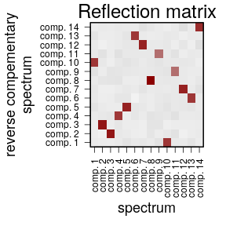

# vrnmf_germline

## Loading the data
The inference requires only a matrix of window-specific mutation rates. Below we use a matrix calculated based on TOPMed dataset:

```r
library(vrnmf)
library(spacemut)

rate.info <- read.table("http://pklab.med.harvard.edu/ruslan/spacemut/tracks/TOPMed_10kb.txt",header=TRUE)
```


```r
head(rate.info[,1:6])
```


| chr|  start|    end|     AAA_C|     AAC_C|     AAG_C|
|---:|------:|------:|---------:|---------:|---------:|
|   1| 770000| 870000| 0.0056657| 0.0357143| 0.0074014|
|   1| 780000| 880000| 0.0082418| 0.0070821| 0.0168406|
|   1| 790000| 890000| 0.0078431| 0.0091439| 0.0314421|
|   1| 800000| 900000| 0.0165351| 0.0293756| 0.0296436|
|   1| 810000| 910000| 0.0082497| 0.0000000| 0.0207556|
|   1| 820000| 920000| 0.0093458| 0.0198020| 0.0185262|

Retain only columns of regional mutation rates:

```r
rate <- rate.info[,-c(1:3)]
```

## Vrnmf inference of spectra of mutational components

First, matrix is preprocessed and required statistics of covariance matrix are estimated using `vol_preprocess` routine:

```r
vol.info <- vol_preprocess(rate)
```


Volume-regularized NMF is applied to the co-occurence mutation matrix stored in the object `vol.info` to infer `n.comp = 14` components using volume weight `wvol = 7.9e-3` (see the manuscript for the motivation behind the choice of parameters). Alternating optimization was executed for `n.iter = 3e+3` iterations with `vol.iter` and `c.iter` updates of matrices inside each iteration:


```r
vr <- volnmf_main(vol.info, n.comp = 14, wvol = 7.9e-3, seed = 1,
                  n.iter = 3e+3, vol.iter = 2e+1, c.iter = 2e+1, 
                  verbose = FALSE)
```

Non-normalized spectra of mutational components are available in the matrix `vr$C`. To reflect the results in the paper, mutational spectra are then renormalized to the genome-average vector of mutation rates:


```r
S <- vr$C*vol.info$col.factors/colMeans(rate)
rownames(S) <- colnames(rate)
colnames(S) <- paste("comp.",1:ncol(S))
```

Note that order of components (columns of `S`) is arbitrary, and may not be consistent with that used in the manuscript. 
Spectra can now be visualized:

```r
draw.signature(S[,2])
```


Additionally, we can explore reflection properties of components:

```r
plot.reflection.matrix(S)
```



And visualize reflections of individual components:

```r
reflection.scatter(2,3,S)
```


## Estimation of intensities of mutational components

Given known spectra of mutational components, intensities can then be obtained using non-negative least squares. A fast per-window estimation is implemented in a routine `infer_intensities`. However, we will additionally model offset spectrum, that would reflect all unaccounted mutational forces, using a routine `factor_intensities` (it takes a few to ten minutes to optimize):


```r
intensities.info <- factor_intensities(as.matrix(vr$C), t(as.matrix(vol.info$X.process)), 
                                  fit.nmf = FALSE, fit.factor = TRUE, 
                                  n.iter = 1e+2, verbose = FALSE) 
```


```r
str(intensities.info)
```

```
## List of 3
##  $ intensities: num [1:14, 1:263870] 8.54 33.29 4.23 7.15 3.03 ...
##   ..- attr(*, "dimnames")=List of 2
##   .. ..$ : chr [1:14] "comp1" "comp2" "comp3" "comp4" ...
##   .. ..$ : NULL
##  $ spec.offset: num [1:192] 0.623 0.336 0.476 0.41 0.555 ...
##  $ int.offset : num [1:263870] 1 1 1 1 1 1 1 1 1 1 ...
```


```r
intensities <- t(intensities.info$intensities)
```

Intensities can now be visualized:

```r
plot.intensities(intensities[,13], rate.info, chr=16, start=0,end=4e+7,  span.wind=30)
```


